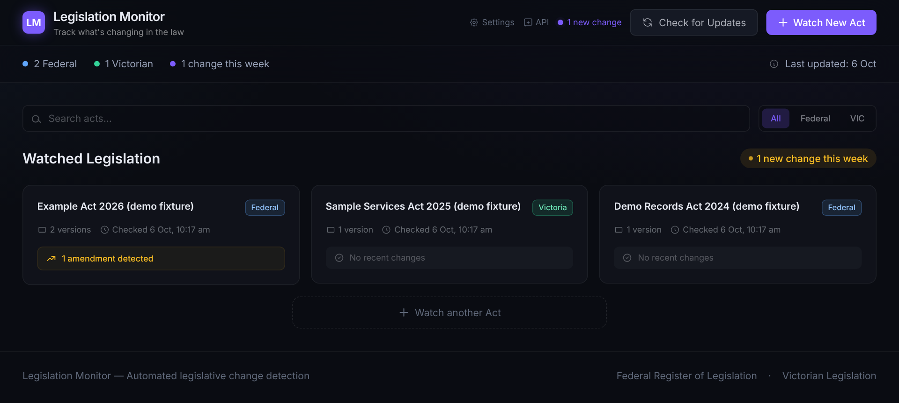
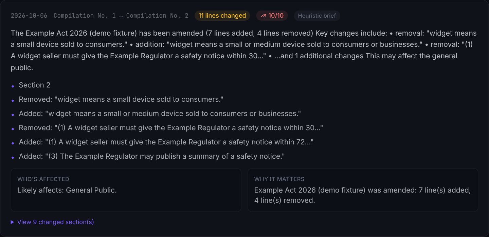
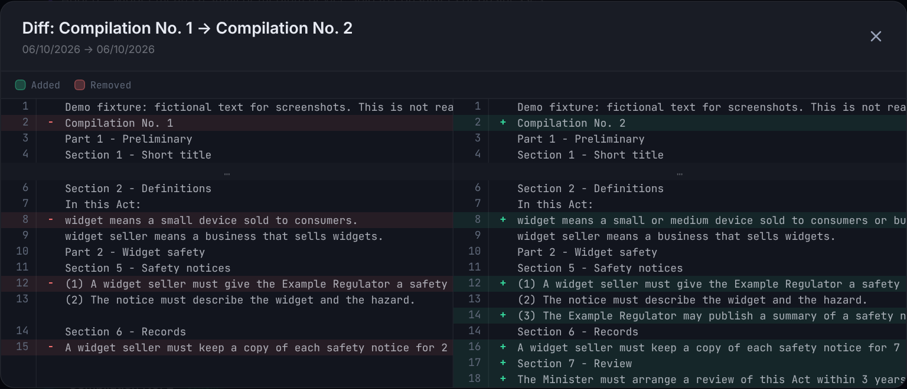

<div align="center">

# Legislation Monitor

### Change detection for Commonwealth and Victorian legislation, with a side-by-side diff of every amendment

 [](https://github.com/Danielkgr/legislation-monitor/actions/workflows/ci.yml)   

</div>

<br>

> Amendments reach the official registers as new compilations, and finding what moved means reading the new text against the old.  Legislation Monitor keeps a local snapshot of each Act it watches, fetches the Act again on request, and shows a side-by-side diff when the text changes.

<br>

## What it is

A local web app and REST API that watches Acts of Parliament for amendments, repeals, and insertions.  It scrapes the Federal Register of Legislation and the Victorian legislation site, hashes the text it extracts, and flags any difference from the last stored version.

> [!IMPORTANT]
> It shows what text changed, not what the change means, so it is not a legal research or advice tool.  It covers Commonwealth and Victorian legislation only.  Everything lives in a local SQLite file, with no accounts and no sync.  It does not check on a schedule by itself.  `npm run check-all`, run from cron or a scheduled workflow, checks every Act and can post a digest to Slack or Teams (see [Scheduled checks and alerts](#scheduled-checks-and-alerts)).

It is a working prototype.  The scrapers follow each register's URL scheme and markup, and will need maintenance when either register changes.  The tests run against synthetic HTML fixtures, not the live registers.

<br>

## Screenshots

> [!NOTE]
> These screenshots use demo data.  The Acts and their text are fictional fixtures written by `npm run demo:seed`, not real legislation.



**Dashboard.**  Three fictional Acts from the demo database, each labelled as a demo fixture.  The banner in the header counts changes recorded since someone last dismissed it.



**Change brief.**  The brief for the demo change, labelled "Heuristic brief" because no model was configured.  With Claude or a local model configured, the label names who wrote it.



**Diff viewer.**  The two demo versions side by side, with removed lines on the left and added lines on the right.

<br>

## Results

113 Vitest tests cover the diff engine, the scrapers and register URL handling on synthetic HTML fixtures, the table-of-contents parser that maps a change to its sections, the check pipeline, the briefs with the Claude and OpenAI-compatible APIs mocked, the digest script and the API routes.  CI runs them with lint, a format check, a type check and a production build on every push.

> [!NOTE]
> This version has not yet been run against the live registers or the live Claude API.  The repository publishes no measurement of how reliably it catches real amendments over time.

<br>

## How it works

| Feature | What happens |
|---|---|
| **Act tracking** | Adding an Act of Parliament, Commonwealth or Victorian, stores a baseline snapshot in SQLite straight away. |
| **Change detection** | A check (the **Check** button, `POST /api/acts/:id/check`, or `npm run check-all` for every Act) fetches the Act's HTML again, hashes the extracted text, and flags anything that differs from the last stored version. |
| **Side-by-side diffs** | The diff viewer marks inserted, deleted, and modified sections. |
| **Change briefs** | Each detected change gets a brief with a summary, the key changes, who is affected, why it matters, and a significance score from 0 to 10.  Claude writes it when an Anthropic API key is set, or any OpenAI-compatible endpoint, such as a local model, when one is configured.  Otherwise a deterministic heuristic writes it.  Every brief records who wrote it, and a heuristic brief written because a model call failed says why. |
| **Dashboard** | One page shows how many Acts are being watched, the split by jurisdiction, and the number of new changes in the last seven days. |
| **REST API** | Every feature has an endpoint, such as `/api/acts` and `/api/changes/:actId`, for alerts or other tools to call. |

### Scrapers

Each jurisdiction has its own scraper, tuned to the structure of its register.

| Register | Approach |
|---|---|
| **Federal** ([legislation.gov.au](https://www.legislation.gov.au)) | Watches each Act at `https://www.legislation.gov.au/<title ID>/latest/text`, which always serves the latest compilation.  Links to a point-in-time version and the register's legacy Details, Latest and Series links are normalised when an Act is added.  The scraper parses the HTML with Cheerio, extracts the page title and main content, and stores the compilation ID, number and date when the page shows them. |
| **Victorian** ([legislation.vic.gov.au](https://www.legislation.vic.gov.au)) | Watches each Act at `https://www.legislation.vic.gov.au/in-force/acts/<act name>`, which always serves the latest version.  Links to a numbered version are normalised when an Act is added.  The scraper rejects anything that is not an Act page, such as the register's "page not found" page.  When it cannot read the Act, the check fails with an error and stores nothing, so an outage never shows up as an amendment. |

> [!CAUTION]
> The URL handling and the compilation metadata patterns follow the registers' published link formats and are tested on synthetic HTML.  They have not yet been run against the live registers.  The [lex-au](https://github.com/cchew/lex-au) project reports that the Federal Register renders Act text in the browser from EPUB files.  If so, a plain HTML fetch of the latest-version page sees only the page shell, and changes would show up only when the shell's compilation details change.  A live run will settle it.

Both scrapers retry network errors, timeouts, HTTP 429 and 5xx responses twice, waiting 1 s and then 2 s, with a 30-second timeout on each attempt.  Other 4xx responses, such as 404, fail at once.  Both hash the normalised text with SHA-256 to detect change.

### Database

On first launch the app creates a SQLite database at `.data/legislation.db`, in WAL mode so reads stay safe while a scrape is running.

| Table | Purpose |
|---|---|
| `acts` | Metadata for each watched Act, such as title, URL, and jurisdiction |
| `versions` | A snapshot of an Act's text at each check, with its content hash |
| `changes` | Each detected difference between versions, including its change brief |
| `settings` | Key-value store for runtime settings, such as the LLM endpoint and the pending-changes counter |

<br>

## Quick start

You need Node.js 20.9 or later, which Next.js 16 requires, and a current browser.

```bash
git clone https://github.com/Danielkgr/legislation-monitor.git
cd legislation-monitor
npm install
npm run dev
```

Open [http://localhost:3000](http://localhost:3000) for the dashboard.  Seven Acts are seeded on the first run, each watched at its latest version.  The same Acts appear as quick-add presets when you watch a new Act.

> [!WARNING]
> Legislation Monitor is a local, single-user tool.  No endpoint asks for a login, including `DELETE /api/acts/:id` and `POST /api/settings`.  `npm run dev` and `npm start` bind to 127.0.0.1, so only the same machine can reach the app.  Do not expose it on a network unless an authenticating reverse proxy sits in front of it.

| Jurisdiction | Seeded Acts |
|---|---|
| **Commonwealth** | *Privacy Act 1988*, *Corporations Act 2001*, *Fair Work Act 2009*, *Work Health and Safety Act 2011* |
| **Victoria** | *Crimes Act 1958*, *Wrongs Act 1958*, *Charter of Human Rights and Responsibilities Act 2006* |

<br>

## Reference

### Scripts

```bash
npm run dev           # development server on 127.0.0.1:3000
npm run build         # production build to .next/
npm run start         # run the production build on 127.0.0.1:3000
npm run check-all     # check every watched Act once and print a digest
npm run demo:seed     # write a demo database of fictional Acts to .data/demo.db
npm run lint          # ESLint
npm run format        # format with Biome
npm run format:check  # fail if any file needs formatting
npm test              # Vitest unit and route tests
```

### API

A full [OpenAPI 3.0](https://spec.openapis.org/oas/v3.0.3) specification ships with the repository at `public/openapi.json`.

| Format | Where |
|---|---|
| **Interactive docs** | [`/docs`](http://localhost:3000/docs), a Swagger UI with try-it-out requests, code samples, and a schema explorer |
| **Raw spec** | [`/openapi.json`](http://localhost:3000/openapi.json), also served by `GET /api/openapi` |

| Method | Endpoint | What it does |
|---|---|---|
| `GET` | `/api/acts` | Lists every watched Act with a change summary |
| `POST` | `/api/acts` | Adds an Act to watch, storing the URL of its latest version |
| `DELETE` | `/api/acts/:id` | Stops watching an Act |
| `GET` | `/api/acts/:id` | Returns an Act's details and metadata |
| `POST` | `/api/acts/:id/check` | Scrapes and compares the Act immediately |
| `GET` | `/api/acts/:id/versions` | Lists every stored version of an Act, with compilation or version details when the page showed them |
| `GET` | `/api/changes/:actId` | Returns detected changes with summaries, affected groups, and briefs |
| `GET` | `/api/changes/:actId/export` | Exports an Act's changes as JSON by default, or as a Markdown report with `?format=md` |
| `GET` | `/api/changes/count` | Returns the pending-changes counter |
| `POST` | `/api/changes/ack` | Resets the pending-changes counter |
| `GET`, `POST` | `/api/settings` | Reads or updates the LLM endpoint settings.  Responses report `hasApiKey` and never return the key.  A blank key in a `POST` keeps the stored one |
| `GET` | `/api/openapi` | Returns the OpenAPI specification |

Every endpoint returns JSON.  Errors come back as `{ "error": "message" }` with a matching HTTP status of 400, 404, 409, or 500.

<details>
<summary><strong>Add an Act</strong> (<code>POST /api/acts</code>)</summary>

```jsonc
// Request
{
  "title": "Privacy Act 1988",                  // required, human-readable title
  "url": "https://www.legislation.gov.au/C2004A03712/latest/text", // required
  "jurisdiction": "federal"                     // optional, "federal" (default) or "vic"
}

// Response 201, Act created
{
  "id": 6,
  "title": "Privacy Act 1988",
  "url": "https://www.legislation.gov.au/C2004A03712/latest/text",
  "jurisdiction": "federal",
  "created_at": "2026-08-15T10:00:00Z",
  "updated_at": "2026-08-15T10:00:00Z"
}

// Response 400, a URL the scrapers cannot watch
{ "error": "Use the Act's page on the Federal Register of Legislation, such as https://www.legislation.gov.au/C2004A03712/latest/text" }

// Response 409, duplicate URL
{ "error": "This Act is already being watched", "id": 1 }
```

</details>

<details>
<summary><strong>Check for changes</strong> (<code>POST /api/acts/:id/check</code>)</summary>

```jsonc
// Response 200
{
  "success": true,
  "hasChange": false,    // true when this check recorded a change against the previous version
  "baseline": false,     // true when this check stored the Act's first version
  "change": null,        // the change record when hasChange is true
  "new_version_count": 12
}
```

</details>

<details>
<summary><strong>List changes</strong> (<code>GET /api/changes/:actId</code>)</summary>

```jsonc
// Response 200, an array of changes
[
  {
    "id": 5,
    "act_id": 1,
    "detected_at": "2026-08-14T09:30:00Z",
    "summary": "The Privacy Act 1988 has been amended (3 lines added, 1 line removed)",
    "sections_changed": ["Added: \"Section 13G\""],
    "affected_groups": ["Individuals & Data Subjects"],
    "change_count": 4,
    "from_label": null,
    "to_label": "2026-08-14"
  }
]
```

</details>

### Running as an API server

```bash
# Development
npm install
npm run dev
# Dashboard      http://localhost:3000
# Swagger UI     http://localhost:3000/docs
# Raw spec       http://localhost:3000/openapi.json

# Production
npm install
npm run build
npm start
# API at http://localhost:3000/api/*
```

The database lives at `.data/legislation.db` inside the working directory.  Copy or mount it to keep state across restarts.

To explore the app without touching the registers, write the demo database and point the app at it:

```bash
npm run demo:seed
LEGISLATION_DB_PATH=.data/demo.db npm run dev
```

The demo Acts live on the reserved `.invalid` domain, so pressing Check on one fails by design.

To use the spec in another tool, import `https://raw.githubusercontent.com/Danielkgr/legislation-monitor/main/public/openapi.json` into Postman (Import, then Link), Insomnia, or Hoppscotch.  To generate a typed client, point [openapi-typescript](https://github.com/openapi-ts/openapi-typescript) at the same URL.

### Configuration

Framework settings, such as rewrites, redirects, and environment variables, live in `next.config.ts`.  The scraper's User-Agent is set inline in `src/lib/scrapers.ts`.  Change it to your own URL if you run a copy.

```typescript
// src/lib/scrapers.ts
"User-Agent": "LegislationMonitor/1.0 (+https://github.com/Danielkgr/legislation-monitor)"
```

### Claude briefs

Choose Claude on the Settings page, or set `LLM_PROVIDER=anthropic` and `ANTHROPIC_API_KEY`.  The call lives in `src/lib/llm-anthropic.ts` and uses the official `@anthropic-ai/sdk`.

| Setting | What it does |
|---|---|
| **Model** | `claude-opus-5-5` by default, or `claude-sonnet-5-5`, from the Settings page or `ANTHROPIC_MODEL` |
| **Effort** | `low` by default, from the Settings page or `ANTHROPIC_EFFORT`, because a brief is short |
| **Output** | Structured outputs with a JSON schema for the brief.  The reply is validated before it is stored |
| **Input** | The unified diff between the two versions, cut at 12,000 characters |
| **Limits** | 16,000 output tokens, a 120-second timeout, and the SDK's two retries for HTTP 408, 409, 429 and 5xx |
| **Fallbacks** | Server-side fallbacks are on.  If Claude's safeguards decline a request, the API re-runs it on the model Anthropic recommends for that kind of refusal, and the brief records which model wrote it |
| **Failure** | A refusal, a reply cut off at the token limit, an invalid reply or an API error leaves the change recorded with a heuristic brief that names the reason |

```bash
ANTHROPIC_API_KEY=sk-ant-... LLM_PROVIDER=anthropic npm run dev
```

> [!NOTE]
> No live Claude call has been run from this repository yet.  The tests run against a mocked API, so the quality and cost of real briefs are not yet measured.  At list prices Claude Opus 5.5 costs $4 per million input tokens and $20 per million output tokens.

### Adding a jurisdiction

1. Add the new jurisdiction identifier to the `jurisdiction` type in `src/lib/db.ts`.
2. Write a `scrapeNewJurisdiction()` function in `src/lib/scrapers.ts`, following the federal and Victorian patterns.
3. Add URL normalisation for the new register to `src/lib/registers.ts`, and any version metadata patterns to `src/lib/scrapers.ts`.

### Scheduled checks and alerts

`npm run check-all` checks every watched Act once, one at a time, and prints a digest of what changed, what failed and what stayed the same.  It uses the same database and brief settings as the app, and does not need the app to be running.  It exits with status 1 when any check failed, so cron and CI can tell.

| Variable | Effect |
|---|---|
| `DIGEST_WEBHOOK_URL` | Also post the digest to this webhook |
| `DIGEST_WEBHOOK_FORMAT` | `slack` (the default) sends `{"text": ...}` to a Slack incoming webhook.  `teams` sends an Adaptive Card to a Teams workflow webhook ("Post to a channel when a webhook request is received") |

A crontab entry that checks at 7am on weekdays and posts to Slack:

```cron
0 7 * * 1-5  cd /path/to/legislation-monitor && DIGEST_WEBHOOK_URL=https://hooks.slack.com/services/... npm run check-all >> .data/check-all.log 2>&1
```

A GitHub Actions workflow that does the same on GitHub's runners.  The database lives in the Actions cache between runs, which GitHub evicts after seven days without use, so treat it as a convenience rather than durable storage.

```yaml
name: Check legislation
on:
  schedule:
    - cron: "0 21 * * 0-4" # 7am AEST, Monday to Friday
  workflow_dispatch:
jobs:
  check:
    runs-on: ubuntu-latest
    steps:
      - uses: actions/checkout@v5
      - uses: actions/setup-node@v5
        with:
          node-version: 22
          cache: npm
      - run: npm ci
      - uses: actions/cache/restore@v4
        with:
          path: .data
          key: legislation-db-${{ github.run_id }}
          restore-keys: legislation-db-
      - run: npm run check-all
        env:
          DIGEST_WEBHOOK_URL: ${{ secrets.DIGEST_WEBHOOK_URL }}
      - uses: actions/cache/save@v4
        if: always()
        with:
          path: .data
          key: legislation-db-${{ github.run_id }}
```

A smoke run of `npm run check-all` in a sandbox that cannot reach the registers reported all seven seeded Acts as failed, stored nothing, posted the digest to a local test webhook, and exited with status 1.  No run against the live registers has been recorded.

The app also keeps a pending-changes counter.  `GET /api/changes/count` returns the number of changes recorded since someone last acknowledged them, and `POST /api/changes/ack` resets it.

### Stack

| Layer | Technology |
|---|---|
| **Framework** | [Next.js 16](https://nextjs.org/) with the App Router |
| **Language** | [TypeScript 5](https://www.typescriptlang.org/) |
| **Styling** | [Tailwind CSS 4](https://tailwindcss.com/) |
| **Database** | [better-sqlite3](https://github.com/WiseLibs/better-sqlite3), a local SQLite file in WAL mode |
| **Scraping** | [Cheerio](https://cheerio.js.org/) for server-side HTML parsing |
| **Diffing** | [jsdiff](https://github.com/kpdecker/jsdiff) |
| **Change briefs** | [Anthropic TypeScript SDK](https://github.com/anthropics/anthropic-sdk-typescript) for Claude, or any OpenAI-compatible endpoint |
| **API docs** | [Swagger UI](https://github.com/swagger-api/swagger-ui) |
| **Tests** | [Vitest](https://vitest.dev/) |

<br>

## Layout

```text
legislation-monitor/
  src/
    app/                    Next.js App Router
      api/
        acts/               Create, read, delete and check watched Acts
        changes/            Change history, export and the pending-changes counter
        settings/           Brief provider settings
      acts/[id]/            Detail and diff pages for each Act
      docs/                 Swagger UI, serving the OpenAPI spec
      globals.css           Tailwind layer styles
      layout.tsx            Root layout (fonts, metadata)
      page.tsx              Dashboard
      settings/             LLM endpoint settings page
    components/             ActCard, AddActForm, CheckButton, DiffViewer
    lib/
      catalogue.ts          Verified Acts used for seeding and quick-add presets
      changes.ts            Change history query
      check.ts              Check pipeline: fetch, hash, store, diff, map, brief
      db.ts                 SQLite schema, seeding, migrations and queries
      demo.ts               Fictional demo Acts for screenshots and walkthroughs
      diff.ts               Text-diff engine
      digest.ts             Check every Act and build the digest
      brief.ts              Brief prompt, JSON schema, validation and heuristic fallback
      llm.ts                Provider switch and the OpenAI-compatible endpoint
      llm-anthropic.ts      Claude briefs through the Anthropic SDK
      registers.ts          Register URL normalisation to the latest version
      scrapers.ts           Federal and Victorian scrapers
      structure.ts          Table-of-contents parsing for section-precise diffs
    types/                  TypeScript declarations
  scripts/
    check-all.ts            npm run check-all
    demo-seed.ts            npm run demo:seed
  docs/images/              Screenshots taken from the demo database
  .github/workflows/ci.yml  Lint, format check, type check, tests and build
  .data/                    Local SQLite database (ignored by git)
  public/                   Static assets and openapi.json
  package.json
```

<br>

## Licence

MIT.  See [LICENSE](LICENSE).  Legislation text comes from the official registers, the [Federal Register of Legislation](https://www.legislation.gov.au) and [Victorian Legislation](https://www.legislation.vic.gov.au).
